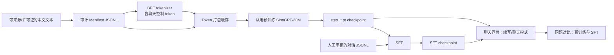

# SinoGPT-30M 从零训练、对话观察与 SFT 设计

## 目标

在单张 RTX 4090（24GB）上训练一个约 30M 参数的中文 decoder-only 语言模型，并让学习者在网页聊天界面中比较不同训练阶段的 checkpoint。项目复现 GPT-3 风格的训练机制，不复刻 175B GPT-3 的参数规模或通用能力。

训练流程必须使学习者能区分：预训练让模型学习下一个 token 的语言分布；SFT 让模型学习对话格式、回答风格和角色约束。

## 非目标

- 不把 SinoGPT-30M 宣称为 GPT-3 等级模型、通用助手或可商用聊天产品。
- 第一阶段不接入 RAG、RLHF、分布式训练或现成底模。
- 不把来源或许可不清晰的文本加入正式训练清单。

## 交付物

1. 可审计中文语料导入命令：导出符合项目 `ManifestRecord` 格式的 train/validation JSONL，并冻结来源、revision、许可证说明、文档哈希与随机种子。
2. 固定词表的 BPE tokenizer：除 `<pad>`、`<bos>`、`<eos>`、`<unk>` 外，训练前加入 `<|system|>`、`<|user|>`、`<|assistant|>`。训练开始后禁止修改词表。
3. 30M 预训练配置与分阶段 checkpoint：使用现有 6 层、384 hidden、6 heads、512 context 的模型；保存可恢复 checkpoint 和 `metrics.jsonl`。
4. 单独的推理与网页聊天模块：加载指定 checkpoint，以同一采样设置生成回复；展示 checkpoint 步数、训练 loss、温度、top-k、最大生成 token 数和随机种子。
5. SFT 数据格式、训练脚本、教程及前后对比：同一聊天 UI 可以切换预训练 checkpoint 与 SFT checkpoint。

## 用户体验与数据流



### 聊天模式

聊天输入统一编码为：

```text
<|system|>你是一个简洁、诚实的中文助手。<|eos|>
<|user|>用户问题<|eos|>
<|assistant|>
```

预训练模型没有经过该格式的监督，它可能只会续写或重复；这是预期的教学现象。SFT 时仅对 assistant 回复 token 计算损失，system/user/padding token 的 label 设为忽略值，避免把提示词当成回答目标。

### checkpoint 比较

聊天界面允许选择多个 checkpoint，但每次生成固定：同一 prompt、同一温度、同一 top-k、同一最大生成长度、同一随机种子。界面保存对比记录，避免把随机采样变化误解为训练改进。

## 分阶段训练

| 阶段 | 训练目标 | 预期观察 | 是否可聊天 |
|---|---:|---|---|
| 冒烟验证 | 至少 1M token | loss、吞吐、保存与恢复均正常 | 否，输出通常无意义 |
| 基础预训练 | 约 20M token | 中文词组与短句出现，重复仍明显 | 仅能演示续写 |
| 可观察预训练 | 约 200M token | 短段落续写较连贯，仍缺乏可靠知识与推理 | 可体验但非助手 |
| SFT | 1,000–5,000 条人工审核对话 | 更遵循角色、问答和简洁性 | 可以展示简单对话 |

每个阶段的评价至少包括 held-out loss、固定 prompts 的样本、重复率/终止率和人工盲测记录。模型输出不能单独用作能力结论。

## 模块边界

| 模块 | 职责 | 不负责 |
|---|---|---|
| `data` 导入模块 | 读取公开数据、清洗、抽样、哈希、输出 manifest | 训练与网页服务 |
| tokenizer 模块 | 固定词表及聊天控制 token | 数据许可判断 |
| pretrain/SFT trainer | 计算 loss、更新参数、checkpoint 恢复 | 浏览器 UI |
| inference 模块 | 模板编码、采样、终止 token 处理 | 读取或更改训练数据 |
| chat UI | 输入、参数控制、checkpoint 选择、结果对比 | 直接修改模型权重 |

## 验证与安全边界

- 每个新增 CLI 先由 pytest 覆盖，再实现；下载和导出不允许静默丢弃记录，必须报告处理数量与过滤原因。
- tokenizer 特殊 token 必须有 round-trip 和 ID 稳定性测试。
- 生成模块必须验证 checkpoint/config/tokenizer 的词表大小一致，避免加载错误模型。
- SFT 的 label mask 必须由测试证明只对 assistant token 产生损失。
- 聊天 UI 默认仅绑定 `127.0.0.1`；云端公开访问由用户显式配置平台端口和访问控制。
- 原始语料和训练产物保持在 `.gitignore` 范围，不提交到公共仓库。

## 成功标准

- 用户能从云端启动网页界面，加载至少一个预训练 checkpoint 并完成一次生成。
- 用户能在同一页面比较至少两个 checkpoint 的固定样例。
- SFT 后的 checkpoint 能正确套用聊天模板，且训练只优化 assistant 回复。
- 所有新命令、数据格式和预期现象均写入 Markdown 教程；测试、lint 和现有训练验收测试全部通过。

## 取舍

选择 Gradio 作为首个界面，原因是它能在同一 Python 项目中实现 GPU 推理与聊天控件，避免在学习阶段引入独立前端、后端和部署栈。先使用 30M 配置而非 125M/350M，以确保单卡预训练、checkpoint 对比和 SFT 能在可控成本内完成；放大实验需要在吞吐、显存和语料规模均有实测记录后再决定。
