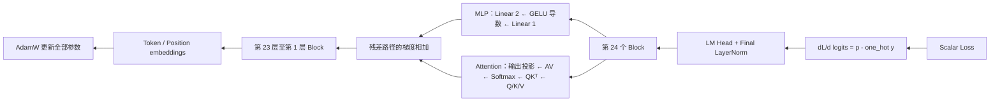

# SinoGPT-350M：单卡可复现的 GPT-3 风格双语预训练项目

## 1. 项目目标与边界

本项目在单张 RTX 4090（24GB 显存）、64GB 内存和 100GB 本地磁盘的云端容器上，从零实现并训练 GPT-3 风格的 decoder-only 语言模型。项目的研究目标是：在固定模型架构与训练预算下，测量中文主导的中英语料配比对中文与英文语言建模能力的影响。

项目不复刻 175B GPT-3，也不宣称达到通用大模型的能力或 SOTA。它是可复现的工程与数据配比实验。核心交付物包括训练代码、数据清单、checkpoint、训练记录、教程文档、神经网络图和论文式报告。

预训练是主线。监督微调（SFT）只作为可选附录，用于展示基础模型如何变成简单的对话演示；RLHF 不在第一版范围内。

## 2. 模型尺度与实验阶段

| 阶段 | 模型 | 参数量 | 训练目的 | token 预算 |
|---|---|---:|---|---:|
| 教程验证 | TinyGPT | 6 层、384 hidden、6 heads | 逐层观察前向、反向与优化器 | 约 100M |
| 数据消融 | GPT-small | 约 125M | 在相同训练预算下比较三种语料配比 | 每组约 300M |
| 主实验 | SinoGPT | 24 层、1024 hidden、16 heads | 在最佳配比上完成正式预训练 | 约 1B |

主模型使用 bf16、梯度累积、激活检查点和可恢复 checkpoint。100GB 本地磁盘只保留代码、token 分片缓存和最近 checkpoint；原始数据及长期 checkpoint 放在对象存储或可挂载数据盘。

## 3. 数据与治理

### 3.1 目标配比

- 中文：70%。候选为 FineWeb2 中文切片和 CCI4.0-M2 的中文部分。
- 英文：20%。优先使用 Common Pile 的过滤版本。
- 代码：10%。只使用能逐文件证明为 MIT、Apache、BSD 等许可的代码；如果无法完成许可证清单，则把该比例转给英文语料。

### 3.2 数据清单

每次实验必须生成并冻结数据清单。每个样本或分片至少记录：数据集名称、版本或 revision、原始 URL、许可证备注、语言标签、内容哈希、去重状态、质量分数、切分（train/validation）与处理脚本版本。

原始语料、训练语料和评测语料按文档哈希去重。验证集在任何训练开始前固定，严禁在训练中重新采样到训练集。数据卡描述潜在个人信息、偏见、许可和再发布限制；许可证记录不是法律意见。

## 4. GPT-3 风格神经网络：逐层前向传播

设 batch 大小为 `B`、上下文长度为 `T`、隐藏维度为 `d=1024`、词表大小为 `V=50,000`。输入 token ID 为 `x ∈ N^(B×T)`，目标为右移一位的 `y`。

1. **分词与嵌入。** BPE tokenizer 将文本转为 token ID。token embedding `E_tok[x]` 与 learned position embedding `E_pos[0:T]` 相加，得到 `H_0 ∈ R^(B×T×d)`。此处没有 ReLU 或 GELU。
2. **第 l 个 Transformer block 的注意力子层。** 先做 LayerNorm：`U = LN_1(H_{l-1})`。再进行三个线性投影：`Q=UW_Q`、`K=UW_K`、`V=UW_V`；它们没有激活函数。按多头拆分后计算 `S=QK^T/sqrt(d_head)+M`，其中因果掩码 `M` 将未来位置设为负无穷。
3. **注意力激活。** `A=softmax(S)` 是注意力权重的归一化非线性；它保证每个位置只分配概率给自己及过去 token。注意力输出为 `O=concat(A V)W_O`，然后做残差相加：`H'=H_{l-1}+O`。
4. **MLP 子层。** `R=LN_2(H')`；第一层全连接将维度扩展到约 `4d`；唯一的隐藏层激活函数是 **GELU**：`GELU(a)=0.5a(1+erf(a/sqrt(2)))`。随后投影回 `d`：`M=GELU(RW_1+b_1)W_2+b_2`，并残差相加得到 `H_l=H'+M`。
5. **输出与损失。** 24 个 block 后做最终 LayerNorm，语言模型头产生 `z=H_24 W_vocab^T`。softmax 把 logits 变为下一个 token 的概率 `p`，交叉熵损失为 `L=-mean(log p[y])`。训练目标是最小化这个标量损失。

LayerNorm 是归一化而非激活函数；残差连接是加法通路；注意力 softmax 是概率归一化；MLP 中的 GELU 才是该模型的主要逐元素激活函数。

### 4.1 神经网络前向传播图

```mermaid
flowchart LR
    A[原始文本] --> B[BPE tokenizer\nToken IDs x]
    B --> C[Token embedding +\nPosition embedding\nH₀]
    C --> D[LayerNorm 1]
    D --> E[Q / K / V\n线性投影\n无激活函数]
    E --> F[QKᵀ / √d + 因果 mask]
    F --> G[Softmax\n注意力概率]
    G --> H[Attention × V\n+ 输出投影]
    C -.残差.-> I[相加 H′]
    H --> I
    I --> J[LayerNorm 2]
    J --> K[Linear 上投影\n1024 → 4096]
    K --> L[GELU\n主要隐藏层激活函数]
    L --> M[Linear 下投影\n4096 → 1024]
    I -.残差.-> N[相加 Hₗ]
    M --> N
    N --> O[重复 24 个 Block]
    O --> P[Final LayerNorm + LM Head]
    P --> Q[Logits]
    Q --> R[Softmax + Cross Entropy]
    R --> S[Scalar Loss]
```

## 5. 反向传播与参数更新

训练调用 `loss.backward()`，自动微分会按链式法则构造与前向相反的梯度路径。

1. 交叉熵对 logits 的局部梯度为 `dL/dz=(softmax(z)-one_hot(y))/N`，其中 `N` 是有效目标 token 数。
2. 该梯度先回传语言模型头和最终 LayerNorm，再从第 24 个 block 倒序回传到第 1 个 block。
3. 经过 MLP 时，梯度依次通过第二个线性层、GELU 导数、第一线性层和 LayerNorm。残差连接把上游梯度分给主分支和跳连分支，再相加。
4. 经过注意力时，梯度依次回传输出投影、`A V` 矩阵乘法、softmax、`QK^T/sqrt(d_head)`、Q/K/V 三个线性投影和 LayerNorm。被因果 mask 屏蔽的位置不获得有效注意力梯度。
5. 梯度最后流向 token embedding 和 position embedding。优化器 AdamW 根据梯度的一阶、二阶动量更新全部参数，并施加解耦权重衰减。

教程模型会打印关键张量的形状、loss、各模块梯度范数和参数更新范数；350M 主模型只写入聚合统计，避免日志与显存开销失控。

## 6. 评测协议

固定中文和英文的 held-out 验证集，报告 validation loss 与 perplexity。数据消融只改变语言配比，保持模型参数、tokenizer、训练 token 数、优化器、学习率日程、batch token 数与评测集一致。主模型报告训练吞吐、显存峰值、训练曲线、固定 prompts 的生成样例和失败案例。

任何关于“中文配比提高中文建模能力”的结论都必须同时附带相应的验证集指标、训练配置和数据清单。生成样例仅为定性补充，不作为单独证据。

## 7. Markdown 教程与论文结构

教程按以下文档编写：项目总览、云端环境、数据治理、训练分词器、GPT-3 架构、前向传播、反向传播、25M 到 350M 训练、评测与消融、论文式报告。每章包含学习目标、前置条件、原理、命令、预期输出、图示、常见故障、复现实验证据和对应论文小节。

论文包括：摘要、引言、相关工作、数据治理、方法、实验设置、结果与消融、局限与伦理、复现附录。方法图展示端到端数据流和 Transformer 的前向/反向传播；教程使用 Mermaid 图，论文使用高分辨率导出图。

## 8. 成功标准

- 25M 模型可从零训练并产生可辨识的中文文本。
- 所有数据与训练运行可由清单、配置、随机种子和 checkpoint 复现。
- 125M 数据消融能生成可比较的中文/英文困惑度结果。
- 350M 主模型完成预定 token 预算或明确报告资源限制与已完成进度。
- 每个训练流程均有对应 Markdown 教程；论文中的每项主张均链接到日志、图表或实验结果。

## 9. 风险与缓解

- **许可证与数据风险：** 仅使用已记录来源和许可的样本；代码样本逐文件审计；不公开再分发受限原始文本。
- **磁盘不足：** 分片流式读取，最近 checkpoint 轮转，长期产物上传对象存储。
- **云端中断：** 定期保存模型、优化器、数据游标和随机状态；支持断点续训。
- **显存不足：** 先在 25M 验证，再使用 bf16、激活检查点、梯度累积和缩短上下文长度进行主模型训练。
- **结论过度：** 论文定位为受限资源下的复现与配比研究，报告局限而不作通用能力或 SOTA 声明。
