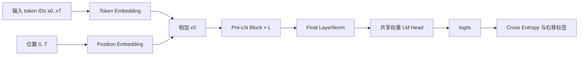

# 从 token 到交叉熵：一次前向传播

## 学习目标

用代码和张量形状逐步追踪 GPT 的一次训练前向计算，并能说明每个激活函数和归一化出现在哪里。

## 前置条件

- 已阅读 `04-GPT3架构.md`，并能区分 token ID、embedding 和 logits。
- 已准备好右移一位的输入/标签样本。

## 原理

### 训练样本如何对齐

对一串 ID `[x0, x1, x2, x3]`，输入为 `[x0, x1, x2]`，标签为右移一位的 `[x1, x2, x3]`。模型在每一个输入位置预测下一个 token。

### 前向流水线

| 步骤 | 代码位置 | 形状 | 计算 |
| --- | --- | --- | --- |
| 1 | `token_embedding` | `[B,T,d]` | 查询 token 向量 |
| 2 | `position_embedding` | `[T,d]` | 查询绝对位置向量并与 token 向量相加 |
| 3 | `Block` × L | `[B,T,d]` | Pre-LN 注意力残差，再 Pre-LN GELU MLP 残差 |
| 4 | `final_norm` | `[B,T,d]` | 最终层归一化 |
| 5 | `lm_head` | `[B,T,V]` | 输出每个词表 token 的未归一化分数 logits |
| 6 | `cross_entropy` | 标量 | 内部执行 log-Softmax，并对右移标签求负对数似然 |

注意：`lm_head.weight = token_embedding.weight`，输入嵌入矩阵与输出投影矩阵共享同一组权重，减少参数并让输入/输出词表表示保持一致。



### 与代码对照

`src/sinogpt/model/gpt.py` 的 `forward` 就是上述六步；`src/sinogpt/model/layers.py` 中 `CausalSelfAttention.forward` 展开了注意力内部公式。模型内部不在注意力投影后或残差后额外插入激活函数；唯一非线性是 GELU 和注意力归一化 Softmax，LayerNorm 也包含均值方差归一化。

### 小例子

```python
import torch
from sinogpt.config import ModelConfig
from sinogpt.model.gpt import GPTLanguageModel

model = GPTLanguageModel(ModelConfig(vocab_size=32, n_layer=2, n_head=4, n_embd=16, block_size=8))
input_ids = torch.tensor([[1, 2, 3]])
targets = torch.tensor([[2, 3, 4]])
logits, loss = model(input_ids, targets)
print(logits.shape, loss.item())  # torch.Size([1, 3, 32])，一个标量损失
```

下一章将从这个交叉熵损失开始，沿计算图逐段说明反向传播和 AdamW 更新。

## 执行命令

```bash
python -m pytest tests/test_model.py -v
```

## 预期输出

示例中的 logits 形状为 `torch.Size([1, 3, 32])`，loss 是一个正的标量。训练时记录的是 cross entropy；它内部采用 log-Softmax，因此代码无需单独实例化一个 Softmax 层来计算损失。

## 常见故障

- `targets` 形状与输入不一致：确保它是同一 token 流右移一位后的 `[B,T]` 张量。
- 误把 attention 的 Softmax 当成 MLP 激活：MLP 激活只有 GELU；attention Softmax 用于将允许位置的注意力分数归一化。

## 复现实验证据

保存一批输入/标签 ID、模型配置、输出形状与损失；还应保存 tokenizer SHA-256，才能将 ID 重新解码。

## 论文对应章节

对应“训练目标与前向计算”章节：给出 next-token prediction、因果掩码、交叉熵与张量形状说明。
